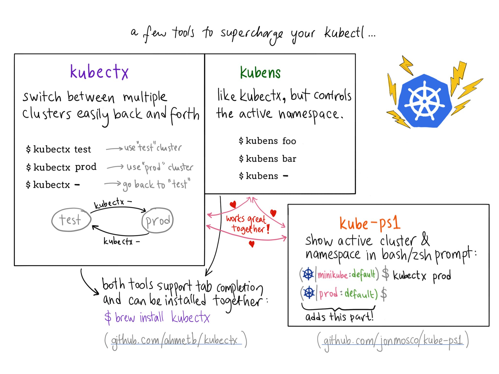

# kubectl In Action

_Or: How to use your Kubernetes remote control_

This is a talk at the [Pre-FOSDEM warmup with Kubernetes](https://www.meetup.com/Brussels-Kubernetes-Meetup/events/245974093/) at Brussels Kubernetes Meetup, on Friday 2018-02-02, with the accompanying slide deck available via [Speaker Deck](https://speakerdeck.com/mhausenblas/kubectl-in-action-or-how-to-use-your-kubernetes-remote-control).

> Kubernetes comes with `kubectl`, a CLI allowing you to interact with your cluster. It supports operations ranging from configuration to managing workloads and services to handle access control to administrative tasks such as node maintenance. In this talk you'll learn everything you need to know getting the most out of `kubectl` (and beyond).

- [Setup](#setup)
- [Contexts](#contexts)
- [Docs](#docs)
- [Managing workloads](#managing-workloads)
- [Services](#services)
- [Accessing the API](#accessing-the-api)
- [RBAC](#rbac)
- [Debugging](#debugging)
- [Tips and tricks](#tips-and-tricks)
- [Tooling](#tooling)
- [Further reading & watching](#further-reading--watching)

## Setup

> I'm new to a cluster, so I have a look around.

What version am I on (client-side and server-side)?

```
$ kubectl version
$ kubectl version --short
```

Can I have a generic dump of `~/.kube/config`?

```
$ kubectl config view
```

## Contexts

> I have multiple clusters, want to switch around.

What contexts are available?

```
$ kubectl config get-contexts
```

Switch to a certain context:

```
$ kubectl config use minikube
```

Create context `somek` and switch to it:

```
$ kubectl config set-context somek --user=cluster-admin --namespace=meh && \
  kubectl config use-context somek
```

## Docs

> I'm lost. I can't remember a command. I need examples.

What can I do with a command?

```
$ kubectl run -h
$ kubectl create -h | less
```

Got some usage examples?

```
$ kubectl run -h | tail -n+$(kubectl run -h | grep -n Example | grep -Eo '^[^:]+') | head -n $(kubectl run -h | grep -n Options | grep -Eo '^[^:]+')
```

What was that field in the manifest again?

```
$ kubectl explain statefulset.spec.template.spec
```

## Managing workloads

> What's running?

I want to get an overview of all pods across all namespaces:

```
$ kubectl get pods --all-namespaces
```

> I want to launch stuff.

Launching a simple jump pod:

```
$ kubectl run -i -t --rm jumpod --restart=Never --image=quay.io/mhausenblas/jump:v0.1 -- sh
```

Do a dry-run for a long-running process (NGINX):

```
$ kubectl run webserver --image=nginx:1.13 --output=yaml --dry-run
```

Get the name of deployment labelled with `run` as key:

```
$ kubectl get deploy -l=run -o=custom-columns=:metadata.name --no-headers
```

Get the name of pod(s) labelled with `run=webserver`:

```
$ kubectl get po -l=run=webserver -o=custom-columns=:metadata.name --no-headers
```

Scale the `webserver` deployment to 2 replicas and observe the scaling:

```
# in shell terminal 1:
$ kubectl get po -l=run=webserver -o=custom-columns=:metadata.name --no-headers --watch

# in shell terminal 2:
$ kubectl scale deploy/webserver --replicas=2
```

Get rid of `webserver` deployment by scaling down to 0 and deleting it:

```
$ kubectl scale deploy/webserver --replicas=0
$ kubectl delete deploy/webserver
```

## Services

> I want to access stuff via the network.

Create a service `webserver` for a deployment and check it:

```
$ kubectl run webserver --image=nginx:1.13
$ kubectl expose deployment webserver --port=80 --target-port=80
$ kubectl describe svc -l=run=webserver
```

I'd like to `curl` the new `webserver` service from within the cluster:

```
$ kubectl run -i -t --rm curlpod --restart=Never --image=quay.io/mhausenblas/jump:v0.1 -- curl webserver
```

## Accessing the API

> I need access to the Kubernetes API for development and testing.

```
$ kubectl proxy
```

## RBAC

> I want to use fine-grained access control.

So, can I have a namespace called `test` please?

```
$ kubectl create -f https://raw.githubusercontent.com/mhausenblas/kbe/master/specs/ns/ns.yaml
```

Let's first create a service account `dummy` in the `test` namespace:

```
$ kubectl create serviceaccount dummy --namespace=test
$ kubectl get sa -n=test
```

Next, creating a role `podreader` in `test` namespace:

```
$ kubectl create role podreader --verb=get --verb=list --resource=pods --namespace=test
$ kubectl get roles --namespace=test
```

And now, I'll use a rolebinding (in namespace `test` ) that connects all above, effectively stating the following: the service account `dummy` is only allowed to list and get pods (aka a `podreader`).

To verify, let's first just have a look at the YAML manifest that represents this access control statement (using `--dry-run=true`) and only then actually create the binding:

```
$ kubectl create rolebinding podreaderbinding --role=podreader --serviceaccount=test:dummy --namespace=test --dry-run=true -o=yaml
$ kubectl create rolebinding podreaderbinding --role=podreader --serviceaccount=test:dummy --namespace=test
```

Now, checking, can the service account `dummy` list pods?

```
$ kubectl auth can-i list pods --as=system:serviceaccount:test:dummy --namespace=test
```

And what about, say, creating services?

```
$ kubectl auth can-i create services --as=system:serviceaccount:test:dummy --namespace=test
```

## Debugging

> I'm in deep trouble. I need to figure out why things went sideways.

Drink from the events firehose:

```
$ kubectl get events
```

Streaming the logs of a pod:

```
$ kubectl logs --follow $(kubectl get po -l=run=webserver -o=custom-columns=:metadata.name --no-headers)
```

Note of a problem and retrieve it:

```
$ kubectl annotate pods $(kubectl get po -l=run=webserver -o=custom-columns=:metadata.name --no-headers) troubleshoot='something really fishy going on here'
$ kubectl describe po $(kubectl get po -l=run=webserver -o=custom-columns=:metadata.name --no-headers) | grep troubleshoot
```

Get the content of a HTTP service running in the cluster to my local machine on port `8080`:

```
$ kubectl port-forward $(kubectl get po -l=run=webserver -o=custom-columns=:metadata.name --no-headers) 8080:80
```

How's one of my nodes doing? Note: requires Heapster installed.

```
$ kubectl top node minikube
```

## Tips and tricks

> I'm sold, `kubectl` is awesome! What else have you got?

- Install and use [auto-complete](https://kubernetes.io/docs/tasks/tools/install-kubectl/#enabling-shell-autocompletion)
- Set `KUBE_EDITOR` to your favorite editor.
- Maybe check out at the [tooling](#tooling) section below and try one or more of the available extensions of `kubectl`?
- Have a look at your history (see also my example).
- Use `kubed-sh` with `debug` mode on.

## Tooling

> Gimme some more tools I can use to make my `kubectl` even cooler.

Extend and enhance `kubectl` with:

- [jonmosco/kube-ps1](https://github.com/jonmosco/kube-ps1)
- [ahmetb/kubectx](https://github.com/ahmetb/kubectx)
- [cloudnativelabs/kube-shell](https://github.com/cloudnativelabs/kube-shell)
- [nii236/kk](https://github.com/nii236/kk)
- [CanopyTax/ckube](https://github.com/CanopyTax/ckube)
- [kubed.sh](http://kubed.sh/)



Source: [Ahmet Alp Balkan](https://twitter.com/ahmetb/status/949064018483802112) on Twitter 01/2018.


## Further reading & watching

> I want to read up and watch more on this topic, any suggestions?

- [kubectl Cheat Sheet](https://kubernetes.io/docs/reference/kubectl/cheatsheet/) via Kubernetes docs
- [Imperative/Declarative and a Few `kubectl` tricks](https://medium.com/bitnami-perspectives/imperative-declarative-and-a-few-kubectl-tricks-9d6deabdde)
- More examples via [kubernetesbyexample.com](http://kubernetesbyexample.com/)
- [Troubleshoot Kubernetes Deployments](https://docs.bitnami.com/kubernetes/how-to/troubleshoot-kubernetes-deployments/)
- [Create less privileges user in kubernetes using RBAC for kubectl](https://blog.goglides.com/2017/11/04/create-less-privileges-user-in-kubernetes-using-rbac-for-kubectl/)
- Deep-dive: [What happens when you do kubectl run](https://github.com/jamiehannaford/what-happens-when-k8s/blob/master/README.md)
- [Kubernetes kubectl Tips and Tricks](https://coreos.com/blog/kubectl-tips-and-tricks)
- [Some things you didn’t know about kubectl](http://blog.kubernetes.io/2015/10/some-things-you-didnt-know-about-kubectl_28.html)
